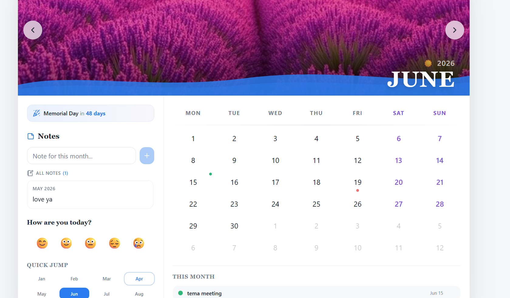

# Chronicle — Interactive Wall Calendar

Chronicle is a premium interactive wall calendar built with React and TypeScript, designed to emulate the aesthetic of a physical wall calendar while delivering a fully functional digital experience. It features multi-day range selection with visual states, a persistent notes system tied to dates and ranges, a color-coded event manager, daily mood tracking, holiday countdowns, and light/dark theme switching — all stored client-side with no backend required.

## Live Demo

[Live Demo](https://chronicle-ashy.vercel.app/)

## Demo

[](https://youtu.be/-VhhvzRQl68)

> Click the screenshot to watch the full demo on YouTube.

## Features

**Core**
- Wall calendar aesthetic with a full-bleed hero image per month, spiral binding detail, and wave SVG overlay
- Month navigation with smooth opacity + scale flip animation
- 7-column date grid (Mon–Sun) with previous/next month fill to always render 6 complete rows
- Day range selector — click a start date, then an end date; distinct visual states for start, end, and in-between days
- Integrated notes panel — add notes scoped to a specific date range or the current month
- All notes visible in a scrollable list at all times; clicking a note card restores its date/range on the calendar
- Add Event modal — event name, day picker (constrained to current month), 6-color swatch picker; saves immediately as colored dots on day cells
- Events listed in a "This Month" panel below the grid, sortable by day, deletable on hover
- Fully responsive — sidebar stacks below the grid on mobile, modal goes full-width, all touch targets sized appropriately

**Bonus / Creative**
- Light/dark theme toggle with smooth CSS variable transitions, persisted to localStorage
- Daily mood tracker (5 emoji states) with per-day dot overlays on the grid and monthly average summary
- Holiday countdown widget showing days until the next US public holiday
- Date range stats panel — total days, workdays, and weekend days in the selected range
- Mini year view for instant month jumping
- "Today" quick-nav button in the hero
- Season emoji alongside the year label in the hero (❄️ / 🌸 / ☀️ / 🍂)
- Holiday dot + tooltip on hover for marked days
- Animated entrance for modals (spring scale-in), note cards (slide-down), range indicator (scale-in), and stats panel

## Tech Stack

- Framework: React 18 + TypeScript (Vite)
- Styling: Tailwind CSS v3 with CSS custom properties for theming
- State: `useCalendarState`, `useNotesStore`, `useEventsStore` — custom hooks, no external state library
- Persistence: localStorage (`chronicle_notes_v1`, `chronicle_events_v1`, `calendar-moods`, `calendar-theme`)
- Fonts: Playfair Display (display headings), Inter (body) — Google Fonts
- Icons: lucide-react
- No backend. No external data dependencies.

## Getting Started

### Prerequisites

- Node.js 18+
- npm or yarn

### Installation

```bash
git clone https://github.com/tejasvi-sinha23/Chronicle
cd Chronicle
npm install
npm run dev
```

Open http://localhost:5173

## Project Structure

```
src/
├── assets/                  # 12 monthly hero images (JPG)
├── components/
│   ├── WallCalendar.tsx     # Root orchestrator — wires all hooks and renders layout
│   ├── CalendarHero.tsx     # Hero image, month/year label, nav arrows, spiral binding
│   ├── CalendarGrid.tsx     # 7-col date grid; DayCell handles visual states + event dots
│   ├── EventModal.tsx       # Animated modal — event name, day picker, color swatches
│   ├── NotesPanel.tsx       # Notes input form + scrollable NoteCard list
│   ├── NoteCard.tsx         # Single note card — label, 2-line clamp, hover delete
│   ├── DateRangeStats.tsx   # Days / workdays / weekends breakdown for selected range
│   ├── HolidayCountdown.tsx # Next US holiday countdown
│   ├── MiniYearView.tsx     # 4×3 month grid for quick navigation
│   ├── MoodTracker.tsx      # Daily emoji mood logger with monthly average
│   └── ThemeToggle.tsx      # Light/dark toggle, persists to localStorage
├── hooks/
│   ├── useCalendar.ts       # useCalendarState (navigation + range), useNotesStore (CRUD)
│   └── useEventsStore.ts    # Event CRUD with localStorage persistence
├── lib/
│   ├── calendar-utils.ts    # getCalendarDays, isSameDay, isInRange, HOLIDAYS, MONTH_IMAGES
│   ├── tokens.ts            # Design tokens (spacing, radii, font sizes) + EVENT_COLORS
│   └── utils.ts             # cn() Tailwind class merger
├── pages/
│   └── Index.tsx            # Route entry point
└── index.css                # CSS custom properties, Tailwind layers, keyframe animations
```

## Design Decisions

**Hook-based separation of concerns.** All calendar navigation and range selection logic lives in `useCalendarState`. Notes CRUD — including key derivation, label formatting, and localStorage sync — lives in `useNotesStore`. Events live in `useEventsStore`. `WallCalendar` is intentionally thin: it calls hooks, derives props, and renders. This makes each concern independently testable and the render tree easy to reason about.

**CSS custom properties for theming.** Rather than toggling class names or injecting inline styles, the entire color system is expressed as HSL CSS variables on `:root` and `.dark`. Tailwind utility classes reference these variables via `hsl(var(--token))`. Switching themes is a single `classList.toggle("dark")` call — no re-renders, no flicker, instant.

**Design tokens as a single source of truth.** `src/lib/tokens.ts` exports a `TOKENS` object for spacing, radii, and font sizes, and an `EVENT_COLORS` array for the six event swatches. No magic numbers or hardcoded hex values appear in component files. This makes visual changes a one-line edit.

**localStorage schema versioning.** Notes are stored under `chronicle_notes_v1` and events under `chronicle_events_v1`. The version suffix means future schema changes can introduce a new key without corrupting existing user data. Each note entry stores `startISO` and `endISO` alongside the display label, so clicking a note card can fully restore the calendar's selection state — including navigating to the correct month.

**Component single-responsibility.** `DayCell` receives pre-computed boolean props (`isStart`, `isEnd`, `inRange`) and an `events` array — it contains zero selection logic. `NoteCard` receives a note object and callbacks — it owns no state. `EventModal` owns its own form state internally and surfaces a clean `onSave(event)` / `onClose()` interface. This keeps the component tree predictable and props explicit.

## Clean Code Practices

- Custom hooks for separation of concerns: `useCalendarState`, `useNotesStore`, `useEventsStore`
- Design token constants in `src/lib/tokens.ts` — no magic numbers or hardcoded colors in JSX
- Single-responsibility components: `DayCell` (renders one day), `NoteCard` (renders one note), `EventModal` (owns form state, emits save/close)
- Boolean state named as questions: `isSelecting`, `isModalOpen`, `isFlipping`, `hasNotes`, `isAnimatingOut`
- Handler functions named as actions: `handleDayClick`, `handleModalSave`, `handleRestoreSelection`, `handleNoteCardClick`
- localStorage persistence with versioned keys: `chronicle_notes_v1`, `chronicle_events_v1`
- All hooks rehydrate from localStorage on mount via initializer functions passed to `useState`

## Deployment

Deployed on Vercel. See live demo link above.
